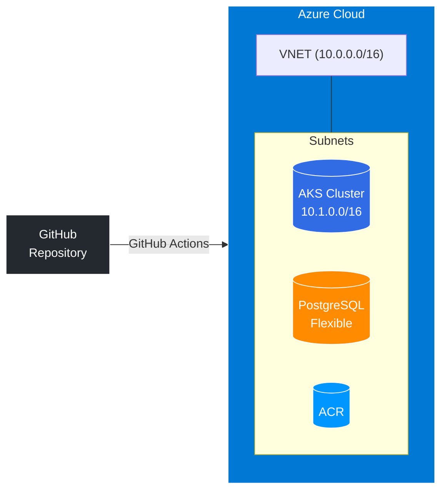

# 🚀 Pipeline CI/CD sur Azure AKS

Projet complet pour déployer une application FastAPI sur Azure Kubernetes Service (AKS) avec infrastructure Terraform et CI/CD GitHub Actions.

## 🏗️ Architecture



## 📁 Structure

```
kubernetes-azure/
├── app/                 # Application FastAPI + Dockerfile
├── terraform/           # IaC (modules: network, aks, acr, postgres)
├── k8s/                 # Manifests Kubernetes
└── .github/workflows/   # CI/CD Pipeline
```

## ⚡ Quick Start

### 1. Terraform (Déployer l'infra)

```bash
cd terraform
terraform init
terraform plan
terraform apply
```

### 2. Docker (Build & Push)

```bash
cd app
docker build -t acrjul24.azurecr.io/fastapi-app:latest .
az acr login -n acrjul24
docker push acrjul24.azurecr.io/fastapi-app:latest
```

### 3. Kubernetes (Déployer l'app)

```bash
az aks get-credentials -g rg-aks-jul24 -n aks-jul24
kubectl apply -f k8s/
```

---

**Repo** : https://github.com/julieparrot91-star/kubernetes-azure

**Portfolio** : https://julien-parrot.fr